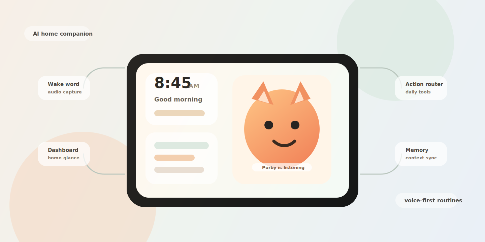

<div align="center">

# Purby

### AI home companion for everyday routines

말을 걸면 듣고, 생각하고, 생활 정보를 정리해주는<br/>
캐릭터 기반 스마트 홈 디스플레이입니다.

<br/>



<br/>
<br/>

<a href="https://github.com/ai-purby/purby-web"><strong>Interface</strong></a>
&nbsp;&nbsp;/&nbsp;&nbsp;
<a href="https://github.com/ai-purby/purby-backend"><strong>AI Backend</strong></a>
&nbsp;&nbsp;/&nbsp;&nbsp;
<a href="https://github.com/ai-purby/purby"><strong>Voice Device</strong></a>
&nbsp;&nbsp;/&nbsp;&nbsp;
<a href="https://github.com/ai-purby/purby-mobile"><strong>Mobile</strong></a>

</div>

---

## Product

Purby는 집 안에서 항상 켜져 있는 작은 AI 동반자입니다. 사용자가 호출어로 말을 걸면 음성을 듣고, 의도를 파악하고, 날씨·일정·메모·기억 같은 생활 기능을 실행합니다.

핵심은 기능보다 경험입니다. Purby는 대시보드, 음성 응답, 3D 캐릭터 상태를 하나로 묶어 사용자가 "기계를 조작한다"기보다 "집 안의 캐릭터에게 부탁한다"고 느끼게 만듭니다.

<table>
  <tr>
    <td width="34%">
      <strong>At a glance</strong><br/>
      시간, 날씨, 일정, 메모, D-Day를 한 화면에 정리합니다.
    </td>
    <td width="33%">
      <strong>Voice first</strong><br/>
      웨이크워드, STT, 의도 분석, TTS 응답까지 하나의 흐름으로 연결합니다.
    </td>
    <td width="33%">
      <strong>Feels alive</strong><br/>
      듣는 중, 생각 중, 말하는 중 같은 상태를 3D 캐릭터로 보여줍니다.
    </td>
  </tr>
</table>

## System

```text
wake word -> voice stream -> STT -> intent -> action router -> TTS
                         \-> character state -> dashboard
```

Purby는 세 개의 레이어로 구성됩니다.

- **Device**: 웨이크워드 감지, 음성 녹음, WebSocket 전송
- **Backend**: STT, LLM 의도 분석, 기능 라우팅, TTS 생성
- **Interface**: 페어링, 홈 대시보드, 캐릭터 상태 스트림, 3D 장면

## Repositories

<table>
  <tr>
    <td width="25%"><a href="https://github.com/ai-purby/purby-web"><strong>purby-web</strong></a></td>
    <td>React, TypeScript, Vite, Tailwind CSS, Zustand, Three.js 기반 디바이스 화면</td>
  </tr>
  <tr>
    <td><a href="https://github.com/ai-purby/purby-backend"><strong>purby-backend</strong></a></td>
    <td>FastAPI, PostgreSQL, Redis 기반 음성 처리와 생활 기능 API</td>
  </tr>
  <tr>
    <td><a href="https://github.com/ai-purby/purby"><strong>purby</strong></a></td>
    <td>Python 기반 웨이크워드 감지와 디바이스 클라이언트 흐름</td>
  </tr>
  <tr>
    <td><a href="https://github.com/ai-purby/purby-mobile"><strong>purby-mobile</strong></a></td>
    <td>모바일 페어링, 사용자 설정, 디바이스 관리 클라이언트</td>
  </tr>
</table>

## Prototype

- 페어링 여부에 따라 QR 페어링 화면과 대시보드 화면을 전환합니다.
- 대시보드는 날씨, 일정, 메모, 시간, 캐릭터 상태를 중심으로 구성됩니다.
- 백엔드는 `character`, `devices`, `memo`, `schedule`, `voice`, `weather` API를 제공합니다.
- 음성 요청은 의도 분석 후 시간, 날씨, 일정, 메모, 기억, smalltalk 기능으로 라우팅됩니다.
- Docker Compose로 FastAPI, PostgreSQL, Redis 실행 구조를 제공합니다.

## Quick Start

### Backend

```bash
cd purby-backend
cp .env.example .env
docker compose up --build
```

### Web / Device UI

```bash
cd purby-front
cp .env.example .env
npm install
npm run dev
```

### Voice Device Client

```bash
cd purby-device
python -m venv .venv
source .venv/bin/activate
pip install -r requirements.txt
python main.py
```

Device Client에는 `PICOVOICE_ACCESS_KEY`, `SERVER_BASE_URL`, 웨이크워드 모델 파일 경로가 필요합니다.

## Next

- 실제 디바이스 시연 영상과 화면 GIF 추가
- 모바일 페어링 이후 설정/관리 플로우 고도화
- 사용자 맞춤형 장기 메모리와 컨텍스트 반영
- 한국어 음성 합성과 캐릭터 애니메이션 품질 개선
- 배포 환경과 API 명세 문서화

---

<div align="center">
  <sub>Purby turns daily routines into a calm, voice-first home experience.</sub>
</div>
