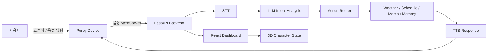

<div align="center">

# Purby

### Always-on AI home display for daily routines

시간, 날씨, 일정, 메모, 음성 응답을 하나의 캐릭터 인터페이스로 연결하는<br/>
AI 기반 스마트 홈 디바이스 프로젝트입니다.

<br/>


<br/>
<br/>

[](https://github.com/ai-purby/purby-web)
[](https://github.com/ai-purby/purby-backend)
[](https://github.com/ai-purby/purby)
[](https://github.com/ai-purby/purby-web)

</div>

---

## What We Are Building

Purby는 사용자가 집 안에서 자연스럽게 말을 걸고, 필요한 생활 정보를 즉시 확인할 수 있는 **상시형 AI 홈 디스플레이**입니다.

기존의 스마트폰 앱, 위젯, 포털 검색에 흩어진 정보를 하나의 화면과 음성 흐름으로 모읍니다. 캐릭터 상태와 3D 애니메이션을 통해 디바이스가 지금 듣고 있는지, 생각 중인지, 말하고 있는지 직관적으로 보여줍니다.

<table>
  <tr>
    <td width="33%">
      <h3>Living Dashboard</h3>
      시간, 날씨, 일정, 메모, D-Day를 한 화면에서 확인하는 홈 대시보드
    </td>
    <td width="33%">
      <h3>Voice Companion</h3>
      웨이크워드 감지부터 STT, 의도 분석, TTS 응답까지 이어지는 음성 인터랙션
    </td>
    <td width="33%">
      <h3>Character UX</h3>
      Idle, Listening, Thinking, Speaking, Sleep, Error 상태를 3D 캐릭터로 표현
    </td>
  </tr>
</table>

## Product Flow



## Highlights

| Area | 구현 내용 |
| --- | --- |
| Device UI | React, TypeScript, Vite 기반 대시보드와 QR 페어링 화면 |
| Character | Three.js 기반 Purby 3D 모델과 상태별 인터랙션 |
| Voice | Picovoice Porcupine 웨이크워드, 음성 녹음, WebSocket 전송 |
| AI Pipeline | STT, LLM 의도 분석, Action Router, TTS 응답 생성 |
| Daily Tools | 시간 조회, 날씨/예보, 일정 CRUD, 메모 CRUD, 사용자 기억 |
| Sync | PostgreSQL, Redis, 디바이스 등록 및 상태 스트림 구조 |

## Repositories

| Repository | Purpose | Stack |
| --- | --- | --- |
| [`purby-web`](https://github.com/ai-purby/purby-web) | 디바이스/웹 대시보드, 페어링 UI, 3D 캐릭터 화면 | React, TypeScript, Vite, Tailwind CSS, Zustand, Three.js |
| [`purby-backend`](https://github.com/ai-purby/purby-backend) | API 서버, 음성 처리, 의도 분석, 기능 라우팅 | FastAPI, SQLAlchemy, PostgreSQL, pgvector, Redis, Docker |
| [`purby`](https://github.com/ai-purby/purby) | 디바이스 클라이언트 및 통합 실행 흐름 | Python, pvporcupine, pvrecorder, WebSocket |
| [`purby-mobile`](https://github.com/ai-purby/purby-mobile) | 모바일 연동, 설정, 디바이스 관리 | Mobile Client |
| [`.github`](https://github.com/ai-purby/.github) | 조직 프로필과 GitHub 공통 문서 | Markdown |

## System Layers

```text
Purby
├─ Device Client
│  ├─ Wake word detection
│  ├─ Voice recording
│  └─ WebSocket audio transport
│
├─ Backend
│  ├─ STT / TTS / LLM intent pipeline
│  ├─ Action router
│  ├─ Weather, schedule, memo, memory services
│  └─ PostgreSQL + Redis persistence
│
└─ Frontend
   ├─ Pairing screen
   ├─ Home dashboard cards
   ├─ Character state stream
   └─ 3D Purby scene
```

## Current Prototype Scope

- 페어링 여부에 따라 QR 페어링 화면과 대시보드 화면을 전환합니다.
- 대시보드는 날씨, 일정, 메모, 시간, 캐릭터 상태를 중심으로 구성됩니다.
- 백엔드는 `character`, `devices`, `memo`, `schedule`, `voice`, `weather` API를 제공합니다.
- 음성 요청은 의도 분석 후 시간, 날씨, 일정, 메모, 기억, smalltalk 기능으로 라우팅됩니다.
- Docker Compose로 FastAPI, PostgreSQL, Redis 실행 구조를 제공합니다.

## Quick Start

### Backend

```bash
cd purby-backend
cp .env.example .env
docker compose up --build
```

### Web / Device UI

```bash
cd purby-front
cp .env.example .env
npm install
npm run dev
```

### Voice Device Client

```bash
cd purby-device
python -m venv .venv
source .venv/bin/activate
pip install -r requirements.txt
python main.py
```

Device Client에는 `PICOVOICE_ACCESS_KEY`, `SERVER_BASE_URL`, 웨이크워드 모델 파일 경로가 필요합니다.

## Roadmap

- 실제 디바이스 시연 영상과 화면 GIF 추가
- 모바일 페어링 이후 설정/관리 플로우 고도화
- 사용자 맞춤형 장기 메모리와 컨텍스트 반영
- 한국어 음성 합성과 캐릭터 애니메이션 품질 개선
- 배포 환경과 API 명세 문서화

---

<div align="center">
  <strong>Purby turns everyday routines into a calm, voice-first home experience.</strong>
</div>
