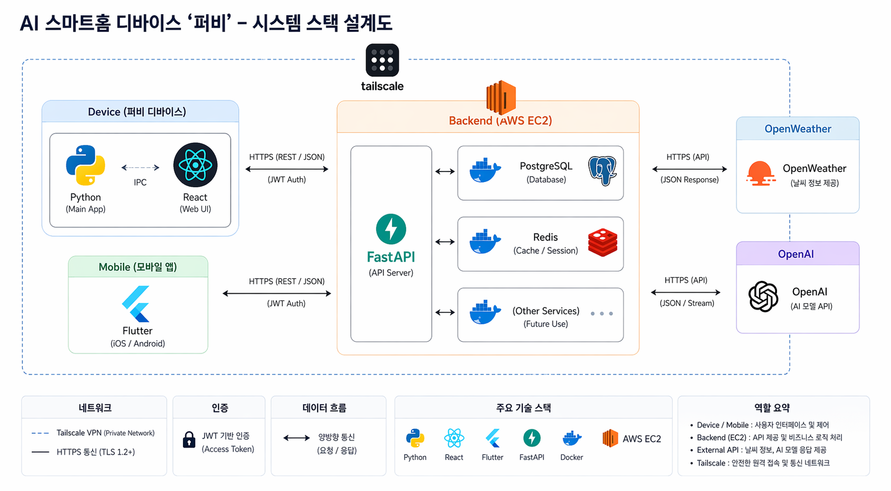
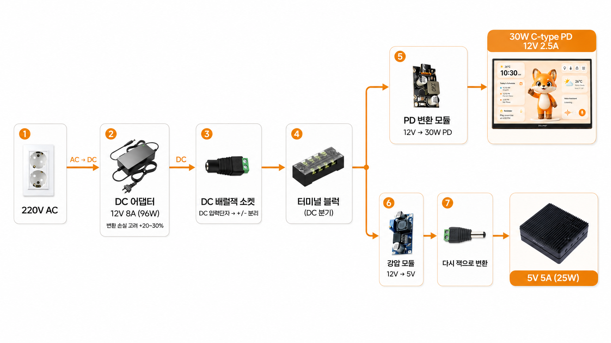

<br/>
<br/>

# 0. Project Intro (프로젝트 소개)

Purby는 음성 인터랙션과 캐릭터 UI를 결합한 AI 스마트 디스플레이입니다.

사용자는 “퍼비야”라는 호출어로 디바이스와 상호작용할 수 있으며, 퍼비는 일정, 날씨, 메모, 알림 등 일상 정보를 친근한 캐릭터 반응과 함께 제공합니다.

<br/>
<br/>

# 1. Project Overview (프로젝트 개요)

- 프로젝트 이름: Purby
- 프로젝트 설명: 음성 인터랙션과 캐릭터 UI를 기반으로 일정, 날씨, 메모, 알림을 제공하는 AI 디지털 액자

Purby는 사용자의 일상 정보를 한눈에 보여주고, 음성 명령을 통해 자연스럽게 상호작용할 수 있는 AI 디지털 액자 프로젝트입니다.</br>
일정 관리, 날씨 확인, 메모, 알림 기능을 제공하며, 친근한 캐릭터 UI를 통해 기존 스마트 디스플레이보다 따뜻하고 감성적인 사용자 경험을 제공합니다.

<br/>
<br/>

# 2. Team Members (팀원 및 팀 소개)

|                                김규민                                |                                 유승민                                 |                                신준수                                 |
| :------------------------------------------------------------------: | :--------------------------------------------------------------------: | :-------------------------------------------------------------------: |
|  |  |  |
|                        팀장 / PM / Infra / FE                        |                          팀원 / Backend / DB                           |                             팀원 / Mobile                             |
|                 [GitHub](https://github.com/Ka11yV)                  |                 [GitHub](https://github.com/msnoeuan)                  |             [GitHub](https://github.com/elizabeth030310)              |

<br/>
<br/>

# 3. Key Features (주요 기능)

- **회원가입**:
  - 사용자는 이메일과 비밀번호를 통해 회원가입할 수 있습니다.
  - 회원가입 시 사용자 정보가 DB에 저장되며, 이후 디바이스 및 모바일 앱과 연동할 수 있습니다.

- **로그인**:
  - 등록된 사용자 인증 정보를 통해 로그인할 수 있습니다.
  - 로그인 후 개인 일정, 메모, 디바이스 정보 등 사용자별 데이터를 관리할 수 있습니다.

- **AI 음성 인터랙션**:
  - 사용자는 “퍼비야”와 같은 호출어를 통해 퍼비와 상호작용할 수 있습니다.
  - 음성 명령을 통해 날씨, 일정, 메모, 타이머 등의 기능을 실행할 수 있습니다.
  - 사용자의 음성을 텍스트로 변환한 뒤, AI가 의도와 필요한 정보를 분석하여 적절한 응답을 제공합니다.

- **캐릭터 기반 디바이스 UI**:
  - 퍼비 캐릭터는 현재 상태에 따라 Idle, Listening, Thinking, Speaking 등의 상태로 변화합니다.
  - 사용자는 단순한 텍스트 화면이 아닌 캐릭터 반응을 통해 더 자연스럽고 친근한 경험을 받을 수 있습니다.
  - 디지털 액자 화면에서 시간, 날씨, 일정, 메모 등 주요 정보를 한눈에 확인할 수 있습니다.

- **날씨 정보 제공**:
  - 사용자의 위치 정보를 기반으로 현재 날씨를 조회할 수 있습니다.
  - 기온, 날씨 상태, 미세먼지, 습도 등의 생활 정보를 제공합니다.
  - 날씨 API 응답은 Redis 캐싱을 통해 반복 요청을 최적화합니다.

- **일정 관리**:
  - 사용자는 등록된 일정을 디바이스 화면에서 확인할 수 있습니다.
  - 오늘의 일정과 다음 일정을 구분하여 보여줍니다.
  - 모바일 앱 또는 서버와 연동하여 사용자별 일정 데이터를 관리할 수 있습니다.

- **메모 기능**:
  - 사용자는 간단한 메모를 저장하고 확인할 수 있습니다.
  - 저장된 메모는 디바이스 화면에서 확인할 수 있으며, 생활 보조 정보로 활용됩니다.

- **타이머 및 알림 기능**:
  - 사용자는 음성 명령을 통해 타이머를 설정할 수 있습니다.
  - 설정된 시간이 지나면 퍼비가 사용자에게 알림을 제공합니다.

- **QR 기반 디바이스 페어링**:
  - 사용자는 모바일 앱에서 QR 코드를 스캔하여 퍼비 디바이스와 계정을 연결할 수 있습니다.
  - 페어링 상태는 생성, 대기, 승인, 연결 완료, 만료 등의 단계로 관리됩니다.
  - 이를 통해 하나의 사용자 계정과 특정 디바이스를 안전하게 연결할 수 있습니다.

- **모바일 앱 연동**:
  - 모바일 앱을 통해 사용자 정보, 일정, 메모, 디바이스 설정 등을 관리할 수 있습니다.
  - 디바이스와 서버, 모바일 앱이 연동되어 사용자별 맞춤형 데이터를 제공합니다.

- **하드웨어 기반 스마트 디스플레이**:
  - Jetson Nano와 포터블 디스플레이를 기반으로 AI 디지털 액자 형태의 디바이스를 구성합니다.
  - 단순 웹 서비스가 아니라 실제 하드웨어에서 동작하는 생활형 AI 디바이스를 목표로 합니다.
  - 단일 전원 어댑터 구조를 고려하여 디바이스 완성도를 높였습니다.

<br/>
<br/>

# 4. Tasks & Responsibilities (작업 및 역할 분담)

| 이름   | 역할                                   | 담당 업무                                                                                                                                                                                                                                                                                                                                         |
| ------ | -------------------------------------- | ------------------------------------------------------------------------------------------------------------------------------------------------------------------------------------------------------------------------------------------------------------------------------------------------------------------------------------------------- |
| 김규민 | 팀장 / Device Frontend / System Design | <ul><li>프로젝트 계획 및 전체 일정 관리</li><li>팀 리딩 및 커뮤니케이션</li><li>전체 시스템 아키텍처 설계</li><li>디바이스 프론트엔드 UI 개발</li><li>캐릭터 기반 상태 UI 설계 및 구현</li><li>날씨 API 연동 및 Redis 캐싱 구조 설계</li><li>Jetson Nano 기반 하드웨어 구성 및 전원 구조 설계</li><li>발표 자료 제작 및 프로젝트 문서화</li></ul> |
| 유승민 | Backend / Database                     | <ul><li>FastAPI 기반 백엔드 서버 개발</li><li>PostgreSQL 데이터베이스 설계 및 관리</li><li>SQLAlchemy 모델 및 Alembic 마이그레이션 관리</li><li>사용자, 일정, 메모 등 주요 도메인 API 개발</li><li>서버 배포 환경 구성 및 Docker 관리</li><li>디바이스 및 모바일 앱 연동 API 구현</li></ul>                                                       |
| 신준수 | Mobile App / Client                    | <ul><li>모바일 앱 개발</li><li>회원가입 및 로그인 화면 구현</li><li>모바일 기반 일정 및 메모 관리 기능 개발</li><li>QR 기반 디바이스 페어링 화면 구현</li><li>디바이스와 모바일 앱 연동 흐름 구현</li><li>모바일 UI/UX 구성 및 기능 테스트</li></ul>                                                                                              |

<br/>
<br/>

# 5. Technology Stack (기술 스택)

## 5.1 Device

<p>
  
  
  
  
</p>

- **React**: 퍼비 디바이스 화면 UI 개발
- **Vite**: 빠른 프론트엔드 개발 환경 구성
- **Zustand**: 캐릭터 상태 및 디바이스 화면 상태 관리
- **Tailwind CSS**: 디바이스 UI 스타일링

<br/>

## 5.2 Mobile

<p>
  
  
</p>

- **Flutter**: 모바일 앱 화면 및 기능 개발
- **Dart**: Flutter 기반 모바일 앱 로직 구현

<br/>

## 5.3 Backend

<p>
  
  
  
  
</p>

- **FastAPI**: REST API 서버 개발
- **SQLAlchemy**: ORM 기반 데이터베이스 모델 관리
- **Alembic**: 데이터베이스 마이그레이션 관리
- **Pydantic**: 요청 및 응답 데이터 검증

<br/>

## 5.4 Database

<p>
  
  
</p>

- **PostgreSQL**: 사용자, 일정, 메모, 디바이스 데이터 저장
- **pgvector**: 벡터 데이터 저장 및 AI 기능 확장을 위한 기반 구성

<br/>

## 5.5 Infra

<p>
  
  
  
</p>

- **Docker**: 서버 실행 환경 컨테이너화
- **Redis**: 캐싱 및 빠른 데이터 처리를 위한 인메모리 저장소
- **Oracle**: 서버 배포 및 인프라 운영 환경 구성

<br/>

## 5.6 AI & Voice

<p>
  
  
  
</p>

- **ElevenLabs**: TTS 기반 음성 응답 생성
- **faster-whisper**: STT 기반 사용자 음성 텍스트 변환
- **Picovoice Porcupine**: “퍼비야” 호출어 감지

<br/>

## 5.7 Hardware

<p>
  
  
</p>

- **Jetson Nano Developer Kit J1020 4GB**: 퍼비 디바이스 실행 보드
- **ZEUSLAP P16K**: 퍼비 캐릭터 UI 및 생활 정보 출력 디스플레이

<br/>

## 5.8 Cooperation

<p>
  
  
  
</p>

- **Git**: 버전 관리
- **GitHub**: 코드 저장소 관리 및 협업
- **ClickUp**: 프로젝트 일정 및 작업 관리

<br/>

<br/>

# 6. Project Structure (프로젝트 구조)

```plaintext
purby-presentation/
├── purby-front/                         # React + TypeScript Vite 프론트엔드
│   ├── index.html                       # Vite HTML 엔트리 파일
│   ├── package.json                     # 프론트엔드 의존성 및 스크립트
│   ├── package-lock.json                # npm 의존성 잠금 파일
│   ├── vite.config.ts                   # Vite 설정
│   ├── eslint.config.js                 # ESLint 설정
│   ├── tsconfig.json                    # TypeScript 공통 설정
│   └── src/
│       ├── main.tsx                     # React 앱 엔트리 포인트
│       ├── App.tsx                      # 메인 애플리케이션 컴포넌트
│       ├── App.css                      # App 전용 스타일
│       ├── index.css                    # 전역 스타일
│       ├── assets/                      # 이미지 및 정적 리소스
│       │   └── purby/                   # 퍼비 3D 모델(GLB) 리소스
│       ├── components/                  # 재사용 가능한 UI 컴포넌트
│       │   ├── calendar/                # 캘린더 관련 컴포넌트
│       │   ├── device-pairing/          # 디바이스 페어링 UI
│       │   └── weather/                 # 날씨 관련 컴포넌트
│       ├── pages/                       # 페이지 단위 컴포넌트
│       │   ├── DashboardPage.tsx        # 메인 대시보드 화면
│       │   └── DevicePairingPage.tsx    # 디바이스 페어링 화면
│       ├── store/                       # Zustand 상태 관리
│       ├── types/                       # TypeScript 타입 정의
│       ├── utils/                       # 공통 유틸 함수
│       └── mocks/                       # 개발용 mock 데이터
│
├── purby-backend/                       # FastAPI 백엔드 서버
│   ├── Dockerfile                       # 백엔드 Docker 이미지 설정
│   ├── docker-compose.yml               # Postgres/Redis 포함 로컬 실행 설정
│   ├── requirements.txt                 # Python 의존성 목록
│   ├── alembic.ini                      # Alembic 마이그레이션 설정
│   ├── alembic/
│   │   ├── env.py                       # Alembic 실행 환경
│   │   └── versions/                    # DB 마이그레이션 파일
│   ├── src/
│   │   ├── main.py                      # FastAPI 앱 엔트리 포인트
│   │   ├── api/                         # API 라우터
│   │   │   ├── devices.py               # 디바이스 API
│   │   │   ├── schedules.py             # 일정 API
│   │   │   ├── memo.py                  # 메모 API
│   │   │   ├── voice.py                 # 음성/WebSocket API
│   │   │   ├── weather.py               # 날씨 API
│   │   │   ├── character_state.py       # 퍼비 캐릭터 상태 API
│   │   │   └── sse.py                   # 서버 이벤트 스트림 API
│   │   ├── core/                        # DB, Redis 등 핵심 인프라 설정
│   │   ├── models/                      # SQLAlchemy 데이터 모델
│   │   ├── schemas/                     # Pydantic 요청/응답 스키마
│   │   ├── services/                    # 비즈니스 로직
│   │   └── utils/                       # 백엔드 공통 유틸
│   └── tests/                           # pytest 테스트 코드
│
├── purby-device/                        # 퍼비 디바이스 Python 클라이언트
│   ├── main.py                          # wake-word 감지, 녹음, WebSocket 전송 로직
│   ├── audio_response.py                # 오디오 응답 처리 로직
│   ├── requirements.txt                 # 디바이스 클라이언트 의존성
│   ├── purby_wakeword_mac.ppn           # Porcupine wake-word 모델
│   ├── porcupine_params_ko.pv           # 한국어 Porcupine 파라미터 모델
│   ├── purby_tts.wav                    # 로컬 음성 샘플 파일
│   └── tests/                           # 디바이스 클라이언트 테스트
│
├── AGENTS.md                            # 전체 워크스페이스 작업 지침
└── README.md                            # 프로젝트 개요 문서
```

<br/>
<br/>

# 7. System Architecture (시스템 아키텍처)



Purby는 디바이스, 모바일 앱, 백엔드 서버, 외부 API가 연결된 AI 스마트홈 디바이스 구조로 설계되었습니다.

디바이스 영역에서는 Python 기반 메인 앱이 호출어 감지, 음성 입력, 서버 통신을 담당하고, React 기반 Web UI가 퍼비 캐릭터 상태와 생활 정보를 화면에 표시합니다. 모바일 앱은 사용자 인증, 일정 및 메모 관리, QR 기반 디바이스 페어링을 제공합니다.

백엔드는 AWS EC2 환경에서 FastAPI 서버로 동작하며, PostgreSQL을 통해 사용자·일정·메모·디바이스 데이터를 저장하고 Redis를 활용해 세션 및 캐시 데이터를 관리합니다. OpenWeather API를 통해 날씨 정보를 조회하고, OpenAI API를 통해 사용자 음성 명령의 의도 분석 및 AI 응답 생성을 처리합니다.

디바이스와 모바일 앱은 HTTPS 기반 REST API로 백엔드와 통신하며, 인증에는 JWT를 사용합니다. 또한 Tailscale VPN을 통해 원격 환경에서도 안전하게 디바이스와 서버를 연결할 수 있도록 구성했습니다.

<br/>
<br/>

# 8. Hardware Design (하드웨어 설계)

Purby 디바이스는 **Jetson Nano Developer Kit J1020 4GB**와 **ZEUSLAP P16K 포터블 디스플레이**를 하나의 액자 프레임 안에 통합하는 구조로 설계했습니다.

전면에는 P16K 디스플레이를 배치하여 퍼비 캐릭터 UI와 일정, 날씨, 메모 등의 생활 정보를 출력하고, 후면 또는 내부 공간에는 Jetson Nano를 배치하여 음성 인식, 서버 통신, 디바이스 제어 로직을 실행합니다. 이를 통해 사용자는 일반 디지털 액자처럼 자연스럽게 설치할 수 있으면서도, 내부적으로는 AI 스마트 디바이스처럼 동작하는 형태를 목표로 했습니다.

<br/>

## 8.1 Power Design (전원 설계)



하드웨어 전원은 하나의 220V AC 입력을 기준으로 구성했습니다.  
AC 전원은 12V DC 어댑터를 통해 변환되며, 변환된 12V 전원은 터미널 블럭에서 디스플레이와 Jetson Nano 전원 라인으로 분기됩니다.

- **P16K 디스플레이**: 12V 전원을 PD 변환 모듈을 통해 USB-C PD 입력으로 변환하여 공급
- **Jetson Nano**: 12V 전원을 강압 모듈을 통해 5V로 변환한 뒤 DC 잭 형태로 공급
- **전원 분기 구조**: 터미널 블럭을 사용해 하나의 어댑터에서 디스플레이와 Jetson Nano에 안정적으로 전원 분배
- **프레임 내부 배치**: Jetson Nano, 전원 변환 모듈, 배선부를 액자 프레임 내부에 배치하여 외부 노출을 최소화

<br/>

## 8.2 Frame Structure (액자 프레임 구조)

Purby의 외형은 디지털 액자 형태를 기준으로 설계했습니다.  
P16K 디스플레이가 전면 화면 역할을 하고, Jetson Nano와 전원 변환 부품은 프레임 내부 또는 후면 공간에 고정됩니다.

이 구조는 다음과 같은 장점을 가집니다.

- 디스플레이와 연산 장치를 하나의 제품 형태로 통합
- 외부에는 전원 케이블만 노출되는 단순한 설치 구조
- 디지털 액자처럼 책상, 선반, 거실 등에 자연스럽게 배치 가능
- 내부 모듈 교체 및 유지보수가 가능한 구조
- 실제 하드웨어 기반 AI 디바이스로서의 완성도 확보

<br/>

## 8.3 Hardware Components (하드웨어 구성 요소)

| 구성 요소                           | 역할                                                    |
| ----------------------------------- | ------------------------------------------------------- |
| Jetson Nano Developer Kit J1020 4GB | 퍼비 디바이스 메인 연산 장치                            |
| ZEUSLAP P16K Portable Display       | 퍼비 캐릭터 UI 및 생활 정보 출력 화면                   |
| 12V DC Adapter                      | 전체 시스템 전원 공급                                   |
| Terminal Block                      | 12V 전원 분기                                           |
| PD Conversion Module                | P16K 디스플레이용 USB-C PD 전원 변환                    |
| Step-down Module                    | Jetson Nano용 12V to 5V 전압 변환                       |
| Frame Body                          | 디스플레이, 보드, 전원 모듈을 수납하는 액자형 외장 구조 |

<br/>
<br/>

<br/>
<br/>
