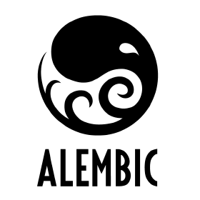
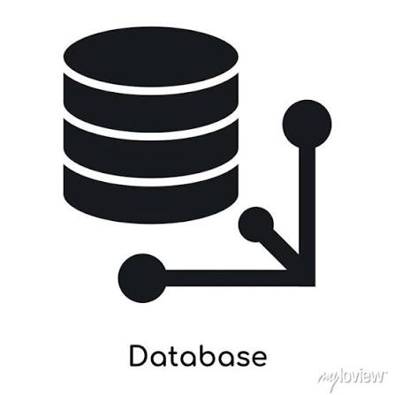
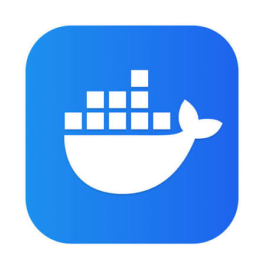
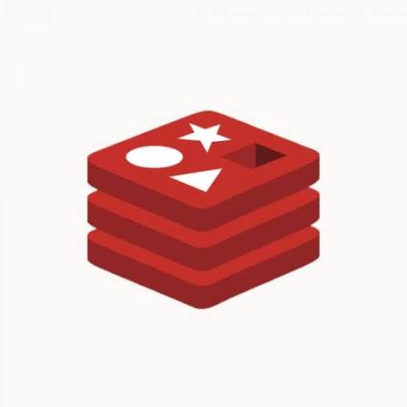
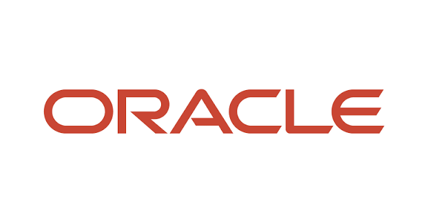
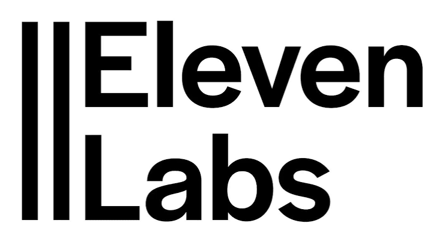
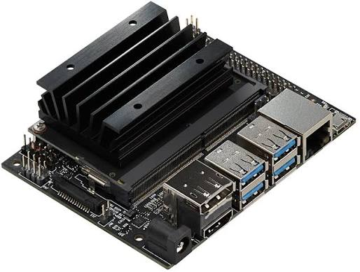

<br/>
<br/>

# 0. Getting Started (시작하기)
```bash
$ npm start
```
[서비스 링크](https://club-project-one.vercel.app/)

<br/>
<br/>

# 1. Project Overview (프로젝트 개요)

* 프로젝트 이름: Purby
* 프로젝트 설명: 음성 인터랙션과 캐릭터 UI를 기반으로 일정, 날씨, 메모, 알림을 제공하는 AI 디지털 액자

Purby는 사용자의 일상 정보를 한눈에 보여주고, 음성 명령을 통해 자연스럽게 상호작용할 수 있는 AI 디지털 액자 프로젝트입니다.</br>
일정 관리, 날씨 확인, 메모, 알림 기능을 제공하며, 친근한 캐릭터 UI를 통해 기존 스마트 디스플레이보다 따뜻하고 감성적인 사용자 경험을 제공합니다.


<br/>
<br/>

# 2. Team Members (팀원 및 팀 소개)
| 김규민 | 유승민 | 신준수 |
|:------:|:------:|:------:|
|  |  | 
| PM, Infra | BE | Mobile | FE |
| [GitHub](https://github.com/LDK1009) | [GitHub](https://github.com/SinYusi) | [GitHub](https://github.com/nay3on)

<br/>
<br/>

# 3. Key Features (주요 기능)

* **회원가입**:

  * 사용자는 이메일과 비밀번호를 통해 회원가입할 수 있습니다.
  * 회원가입 시 사용자 정보가 DB에 저장되며, 이후 디바이스 및 모바일 앱과 연동할 수 있습니다.

* **로그인**:

  * 등록된 사용자 인증 정보를 통해 로그인할 수 있습니다.
  * 로그인 후 개인 일정, 메모, 디바이스 정보 등 사용자별 데이터를 관리할 수 있습니다.

* **AI 음성 인터랙션**:

  * 사용자는 “퍼비야”와 같은 호출어를 통해 퍼비와 상호작용할 수 있습니다.
  * 음성 명령을 통해 날씨, 일정, 메모, 타이머 등의 기능을 실행할 수 있습니다.
  * 사용자의 음성을 텍스트로 변환한 뒤, AI가 의도와 필요한 정보를 분석하여 적절한 응답을 제공합니다.

* **캐릭터 기반 디바이스 UI**:

  * 퍼비 캐릭터는 현재 상태에 따라 Idle, Listening, Thinking, Speaking 등의 상태로 변화합니다.
  * 사용자는 단순한 텍스트 화면이 아닌 캐릭터 반응을 통해 더 자연스럽고 친근한 경험을 받을 수 있습니다.
  * 디지털 액자 화면에서 시간, 날씨, 일정, 메모 등 주요 정보를 한눈에 확인할 수 있습니다.

* **날씨 정보 제공**:

  * 사용자의 위치 정보를 기반으로 현재 날씨를 조회할 수 있습니다.
  * 기온, 날씨 상태, 미세먼지, 습도 등의 생활 정보를 제공합니다.
  * 날씨 API 응답은 Redis 캐싱을 통해 반복 요청을 최적화합니다.

* **일정 관리**:

  * 사용자는 등록된 일정을 디바이스 화면에서 확인할 수 있습니다.
  * 오늘의 일정과 다음 일정을 구분하여 보여줍니다.
  * 모바일 앱 또는 서버와 연동하여 사용자별 일정 데이터를 관리할 수 있습니다.

* **메모 기능**:

  * 사용자는 간단한 메모를 저장하고 확인할 수 있습니다.
  * 저장된 메모는 디바이스 화면에서 확인할 수 있으며, 생활 보조 정보로 활용됩니다.

* **타이머 및 알림 기능**:

  * 사용자는 음성 명령을 통해 타이머를 설정할 수 있습니다.
  * 설정된 시간이 지나면 퍼비가 사용자에게 알림을 제공합니다.

* **QR 기반 디바이스 페어링**:

  * 사용자는 모바일 앱에서 QR 코드를 스캔하여 퍼비 디바이스와 계정을 연결할 수 있습니다.
  * 페어링 상태는 생성, 대기, 승인, 연결 완료, 만료 등의 단계로 관리됩니다.
  * 이를 통해 하나의 사용자 계정과 특정 디바이스를 안전하게 연결할 수 있습니다.

* **모바일 앱 연동**:

  * 모바일 앱을 통해 사용자 정보, 일정, 메모, 디바이스 설정 등을 관리할 수 있습니다.
  * 디바이스와 서버, 모바일 앱이 연동되어 사용자별 맞춤형 데이터를 제공합니다.

* **하드웨어 기반 스마트 디스플레이**:

  * Jetson Nano와 포터블 디스플레이를 기반으로 AI 디지털 액자 형태의 디바이스를 구성합니다.
  * 단순 웹 서비스가 아니라 실제 하드웨어에서 동작하는 생활형 AI 디바이스를 목표로 합니다.
  * 단일 전원 어댑터 구조를 고려하여 디바이스 완성도를 높였습니다.


<br/>
<br/>

# 4. Tasks & Responsibilities (작업 및 역할 분담)

| 이름  | 역할                                   | 담당 업무                                                                                                                                                                                                                                            |
| --- | ------------------------------------ | ------------------------------------------------------------------------------------------------------------------------------------------------------------------------------------------------------------------------------------------------ |
| 김규민 | 팀장 / Device Frontend / System Design | <ul><li>프로젝트 계획 및 전체 일정 관리</li><li>팀 리딩 및 커뮤니케이션</li><li>전체 시스템 아키텍처 설계</li><li>디바이스 프론트엔드 UI 개발</li><li>캐릭터 기반 상태 UI 설계 및 구현</li><li>날씨 API 연동 및 Redis 캐싱 구조 설계</li><li>Jetson Nano 기반 하드웨어 구성 및 전원 구조 설계</li><li>발표 자료 제작 및 프로젝트 문서화</li></ul> |
| 유승민 | Backend / Database                   | <ul><li>FastAPI 기반 백엔드 서버 개발</li><li>PostgreSQL 데이터베이스 설계 및 관리</li><li>SQLAlchemy 모델 및 Alembic 마이그레이션 관리</li><li>사용자, 일정, 메모 등 주요 도메인 API 개발</li><li>서버 배포 환경 구성 및 Docker 관리</li><li>디바이스 및 모바일 앱 연동 API 구현</li></ul>                            |
| 신준수 | Mobile App / Client                  | <ul><li>모바일 앱 개발</li><li>회원가입 및 로그인 화면 구현</li><li>모바일 기반 일정 및 메모 관리 기능 개발</li><li>QR 기반 디바이스 페어링 화면 구현</li><li>디바이스와 모바일 앱 연동 흐름 구현</li><li>모바일 UI/UX 구성 및 기능 테스트</li></ul>                                                                      |

<br/>
<br/>

# 5. Technology Stack (기술 스택)

## 5.1 Language

# 5. Technology Stack (기술 스택)

## 5.1 Device

| 기술           | 아이콘                                                                      | 사용 목적                  |
| ------------ | ------------------------------------------------------------------------ | ---------------------- |
| React        |               | 퍼비 디바이스 화면 UI 개발       |
| Vite         |                 | 빠른 프론트엔드 개발 환경 구성      |
| Zustand      |           | 캐릭터 상태 및 디바이스 화면 상태 관리 |
| Tailwind CSS |  | 디바이스 UI 스타일링           |

<br/>

## 5.2 Mobile

| 기술      | 아이콘                                                             | 사용 목적                  |
| ------- | --------------------------------------------------------------- | ---------------------- |
| Flutter |  | 모바일 앱 화면 및 기능 개발       |
| Dart    |        | Flutter 기반 모바일 앱 로직 구현 |

<br/>

## 5.3 Backend

| 기술         | 아이콘                                                                   | 사용 목적               |
| ---------- | --------------------------------------------------------------------- | ------------------- |
| FastAPI    |        | REST API 서버 개발      |
| SQLAlchemy |  | ORM 기반 데이터베이스 모델 관리 |
| Alembic    |        | 데이터베이스 마이그레이션 관리    |
| Pydantic   |      | 요청 및 응답 데이터 검증      |

<br/>

## 5.4 Database

| 기술         | 아이콘                                                                   | 사용 목적                          |
| ---------- | --------------------------------------------------------------------- | ------------------------------ |
| PostgreSQL |  | 사용자, 일정, 메모, 디바이스 데이터 저장       |
| pgvector   |      | 벡터 데이터 저장 및 AI 기능 확장을 위한 기반 구성 |

<br/>

## 5.5 Infra

| 기술     | 아이콘                                                           | 사용 목적                       |
| ------ | ------------------------------------------------------------- | --------------------------- |
| Docker |  | 서버 실행 환경 컨테이너화              |
| Redis  |    | 캐싱 및 빠른 데이터 처리를 위한 인메모리 저장소 |
| Oracle |  | 서버 배포 및 인프라 운영 환경 구성        |

<br/>

## 5.6 AI & Voice

| 기술                  | 아이콘                                                                           | 사용 목적                |
| ------------------- | ----------------------------------------------------------------------------- | -------------------- |
| ElevenLabs          |          | TTS 기반 음성 응답 생성      |
| faster-whisper      |  | STT 기반 사용자 음성 텍스트 변환 |
| Picovoice Porcupine |  | “퍼비야” 호출어 감지         |

<br/>

## 5.7 Hardware

| 기술                                  | 아이콘                                                                                             | 사용 목적                      |
| ----------------------------------- | ----------------------------------------------------------------------------------------------- | -------------------------- |
| Jetson Nano Developer Kit J1020 4GB |  | 퍼비 디바이스 실행 보드              |
| ZEUSLAP P16K                        |                        | 퍼비 캐릭터 UI 및 생활 정보 출력 디스플레이 |

<br/>

## 5.8 Cooperation

| 기술      | 아이콘                                                             | 사용 목적           |
| ------- | --------------------------------------------------------------- | --------------- |
| Git     |          | 버전 관리           |
| GitHub  |    | 코드 저장소 관리 및 협업  |
| ClickUp |  | 프로젝트 일정 및 작업 관리 |


<br/>

# 6. Project Structure (프로젝트 구조)
```plaintext
project/
├── public/
│   ├── index.html           # HTML 템플릿 파일
│   └── favicon.ico          # 아이콘 파일
├── src/
│   ├── assets/              # 이미지, 폰트 등 정적 파일
│   ├── components/          # 재사용 가능한 UI 컴포넌트
│   ├── hooks/               # 커스텀 훅 모음
│   ├── pages/               # 각 페이지별 컴포넌트
│   ├── App.js               # 메인 애플리케이션 컴포넌트
│   ├── index.js             # 엔트리 포인트 파일
│   ├── index.css            # 전역 css 파일
│   ├── firebaseConfig.js    # firebase 인스턴스 초기화 파일
│   package-lock.json    # 정확한 종속성 버전이 기록된 파일로, 일관된 빌드를 보장
│   package.json         # 프로젝트 종속성 및 스크립트 정의
├── .gitignore               # Git 무시 파일 목록
└── README.md                # 프로젝트 개요 및 사용법
```

<br/>
<br/>

# 7. Development Workflow (개발 워크플로우)
## 브랜치 전략 (Branch Strategy)
우리의 브랜치 전략은 Git Flow를 기반으로 하며, 다음과 같은 브랜치를 사용합니다.

- Main Branch
  - 배포 가능한 상태의 코드를 유지합니다.
  - 모든 배포는 이 브랜치에서 이루어집니다.
  
- {name} Branch
  - 팀원 각자의 개발 브랜치입니다.
  - 모든 기능 개발은 이 브랜치에서 이루어집니다.

<br/>
<br/>

# 8. Coding Convention
## 문장 종료
```
// 세미콜론(;)
console.log("Hello World!");
```

<br/>


## 명명 규칙
* 상수 : 영문 대문자 + 스네이크 케이스
```
const NAME_ROLE;
```
* 변수 & 함수 : 카멜케이스
```
// state
const [isLoading, setIsLoading] = useState(false);
const [isLoggedIn, setIsLoggedIn] = useState(false);
const [errorMessage, setErrorMessage] = useState('');
const [currentUser, setCurrentUser] = useState(null);

// 배열 - 복수형 이름 사용
const datas = [];

// 정규표현식: 'r'로 시작
const = rName = /.*/;

// 이벤트 핸들러: 'on'으로 시작
const onClick = () => {};
const onChange = () => {};

// 반환 값이 불린인 경우: 'is'로 시작
const isLoading = false;

// Fetch함수: method(get, post, put, del)로 시작
const getEnginList = () => {...}
```

<br/>

## 블록 구문
```
// 한 줄짜리 블록일 경우라도 {}를 생략하지 않고, 명확히 줄 바꿈 하여 사용한다
// good
if(true){
  return 'hello'
}

// bad
if(true) return 'hello'
```

<br/>

## 함수
```
함수는 함수 표현식을 사용하며, 화살표 함수를 사용한다.
// Good
const fnName = () => {};

// Bad
function fnName() {};
```

<br/>

## 태그 네이밍
Styled-component태그 생성 시 아래 네이밍 규칙을 준수하여 의미 전달을 명확하게 한다.<br/>
태그명이 길어지더라도 의미 전달의 명확성에 목적을 두어 작성한다.<br/>
전체 영역: Container<br/>
영역의 묶음: {Name}Area<br/>
의미없는 태그: <><br/>
```
<Container>
  <ContentsArea>
    <Contents>...</Contents>
    <Contents>...</Contents>
  </ContentsArea>
</Container>
```

<br/>

## 폴더 네이밍
카멜 케이스를 기본으로 하며, 컴포넌트 폴더일 경우에만 파스칼 케이스로 사용한다.
```
// 카멜 케이스
camelCase
// 파스칼 케이스
PascalCase
```

<br/>

## 파일 네이밍
```
컴포넌트일 경우만 .jsx 확장자를 사용한다. (그 외에는 .js)
customHook을 사용하는 경우 : use + 함수명
```

<br/>
<br/>

# 9. 커밋 컨벤션
## 기본 구조
```
type : subject

body 
```

<br/>

## type 종류
```
feat : 새로운 기능 추가
fix : 버그 수정
docs : 문서 수정
style : 코드 포맷팅, 세미콜론 누락, 코드 변경이 없는 경우
refactor : 코드 리펙토링
test : 테스트 코드, 리펙토링 테스트 코드 추가
chore : 빌드 업무 수정, 패키지 매니저 수정
```

<br/>

## 커밋 이모지
```
== 코드 관련
📝	코드 작성
🔥	코드 제거
🔨	코드 리팩토링
💄	UI / style 변경

== 문서&파일
📰	새 파일 생성
🔥	파일 제거
📚	문서 작성

== 버그
🐛	버그 리포트
🚑	버그를 고칠 때

== 기타
🐎	성능 향상
✨	새로운 기능 구현
💡	새로운 아이디어
🚀	배포
```

<br/>

## 커밋 예시
```
== ex1
✨Feat: "회원 가입 기능 구현"

SMS, 이메일 중복확인 API 개발

== ex2
📚chore: styled-components 라이브러리 설치

UI개발을 위한 라이브러리 styled-components 설치
```

<br/>
<br/>

# 10. 컨벤션 수행 결과


